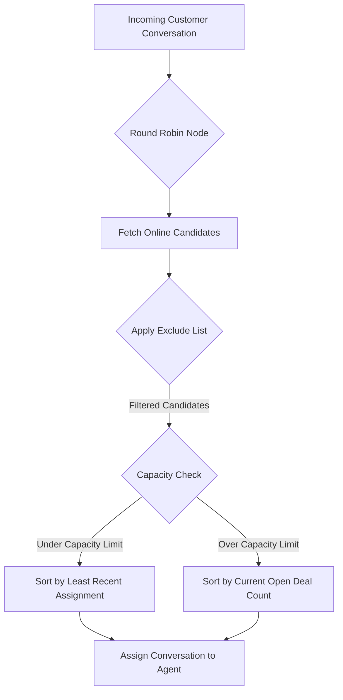
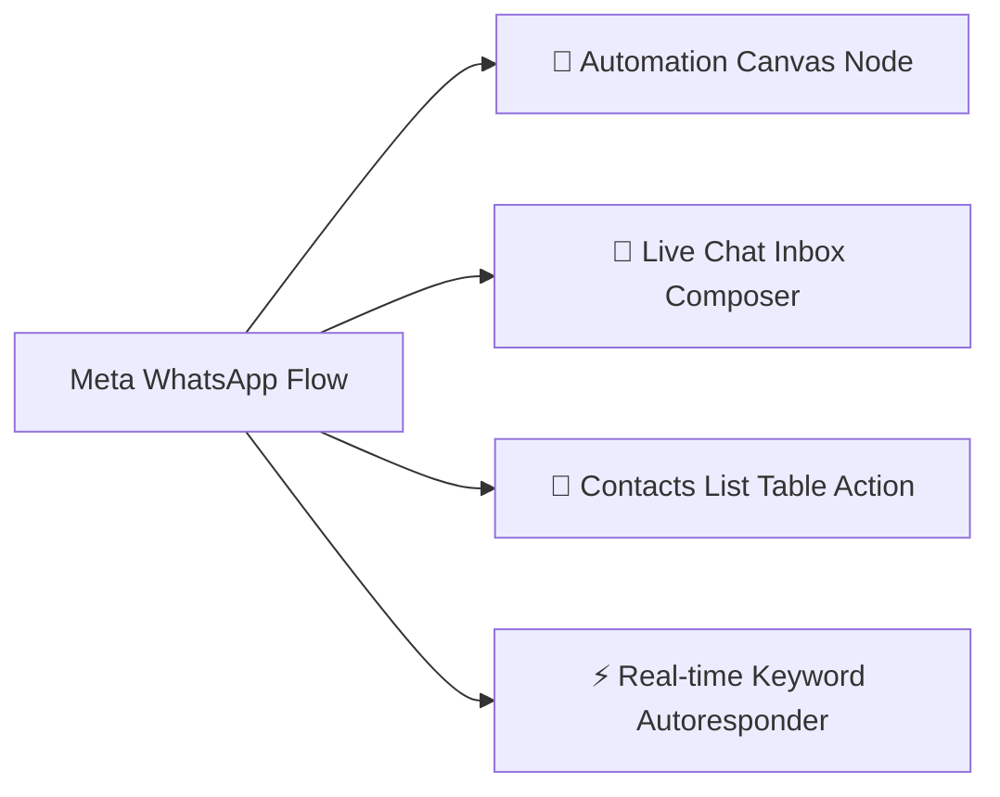

# 🚀 WhatsApp CRM, Automation & Meta WhatsApp Flows Platform Documentation

This comprehensive documentation details the architecture, configuration, and capabilities of your multi-tenant WhatsApp CRM, visual workflow automation, e-commerce engine, and native **Meta WhatsApp Flows** platform.

---

## 📋 Table of Contents
1. [Core CRM Features](#1-core-crm-features)
2. [Advanced Automation & Routing Features](#2-advanced-automation--routing-features)
3. [Special Highlight: CRM Round Robin Node](#3-special-highlight-crm-round-robin-node)
4. [Special Highlight: Recurring Contact Campaigns](#4-special-highlight-recurring-contact-campaigns)
5. [E-commerce Module & Add-ons](#5-e-commerce-module--add-ons)
6. [Advanced AI & Inbox Integrations](#6-advanced-ai--inbox-integrations)
7. [AI Flow Controls & Functions](#7-ai-flow-controls--functions)
8. [Meta WhatsApp Flows (Native Interactive Forms & Surveys)](#8-meta-whatsapp-flows-native-interactive-forms--surveys)
   * [8.1 Architecture & Native Flow Mechanics](#81-architecture--native-flow-mechanics)
   * [8.2 Visual Form Designer Wizard (4 Steps)](#82-visual-form-designer-wizard-4-steps)
   * [8.3 Pre-built Flow Templates](#83-pre-built-flow-templates)
   * [8.4 The 4 Initiation Channels](#84-the-4-initiation-channels)
   * [8.5 Automated CRM Sync & Data Ingestion](#85-automated-crm-sync--data-ingestion)
   * [8.6 Submissions Tracker & Excel (.xlsx) Export](#86-submissions-tracker--excel-xlsx-export)

---

## 1. Core CRM Features

### 👤 Contact & Lead Management
* **Unified Database**: Consolidates lead source details, WhatsApp phone numbers, customized attributes, tags, status history, and WhatsApp Flow submissions.
* **Smart Filtering**: Advanced query builders to segment lists based on groups, broadcast lists, tags, channel, and custom variables.
* **Customer Groups & Broadcast Lists**: Create static or dynamic list groups and QR broadcast lists for targeted outreach.

### 💼 Pipelines, Stages, & Deals
* **Custom Pipelines**: Create multiple visual sales funnels (e.g., Sales, Onboarding, Support, VIP Accounts).
* **Drag-and-Drop Stages**: Easily transition deals between stages (e.g., Lead, Contacted, Proposal, Closed-Won).
* **Deal Metadata**: Track deal values, assignees, products, currencies, and timestamps.

### 👥 Team & Workspace Management
* **Multi-Agent Inbox**: Share inbox conversations across team members.
* **Granular Permissions**: Restrict or grant team member access by roles (e.g., view only assigned conversations, edit store configurations, delete contacts).
* **Capacity Management**: Specify an integer-based **Open Deals Capacity Limit** per agent to prevent workloads from bottlenecking.

---

## 2. Advanced Automation & Routing Features

### 🛠️ Interactive Flow Builder
* **Visual Canvas Designer**: Map automated customer journeys using trigger keywords, conditions, delays, message blocks, and actions.
* **Action Nodes**: Automatically route leads, update variables, generate payment links, and assign conversations.
* **Native WhatsApp Nodes**: Send interactive menus, templates, media, location cards, and **WhatsApp Flows**.

---

## 3. Special Highlight: CRM Round Robin Node

The **CRM Round Robin Node** is designed for high-efficiency lead routing. When triggered, it automatically rotates new incoming conversations between eligible team members.

### How It Works:


### Key Capabilities:
1. **Online Status Only**: Assigns conversations only to active team members whose current status is set to `Online`.
2. **Open Deal Capacity Limit**: If a team member has an open deal count matching or exceeding their configured **Capacity Limit**, they are skipped from the normal rotation.
3. **Smart Load Balancing**: Sorts available agents by their last assignment timestamp, ensuring rotation cycles are balanced and fair.
4. **Agent Exclusion List**: Exclude specific team members or administrators from the rotation.

---

## 4. Special Highlight: Recurring Contact Campaigns

### Capabilities:
* **Dynamic Recurrence Rules**: Define schedule cycles (daily, weekly, monthly, yearly) with precise time slots.
* **Dynamic Content Variables**: Inject contact tags and custom fields (e.g., `{{contact.firstName}}`, `{{order.number}}`) into WhatsApp template structures.
* **Batch Scheduling**: Staggers campaign deliveries to optimize WhatsApp API rates and prevent account flags.

---

## 5. E-commerce Module & Add-ons

* **Product Catalogs**: Manage products, descriptions, photos, and prices from the admin ledger.
* **Base Currency Controls**: Enforces store-wide currency prefixes on all products, orders, invoices, and payment links.
* **Dynamic Delivery Fees**: Flat rate or state-wise rules powered by live ZIP code lookups.
* **Automated PDF Invoices**: Generates a professional itemized invoice PDF immediately when payment is verified as `"paid"`, automatically dispatching it to the customer.
* **Self-Service Order Tracking**: Customers can check on their orders by texting **`track`** or **`status`**.

---

## 6. Advanced AI & Inbox Integrations

* **AI Copilot & Smart Reply**: Suggests contextual responses directly inside the live chat inbox.
* **AI Knowledge Base**: Ingests company documentation, FAQs, and catalogs to answer customer inquiries autonomously.
* **Human Handover**: Seamlessly transfers conversations from AI to human agents upon keyword triggers or sentiment flags.

---

## 7. AI Flow Controls & Functions

* **AI Answer Node**: Answers specific prompts within an automation journey based on scoped knowledge sources.
* **AI Agent Node**: Multi-turn autonomous conversational agent embedded directly into visual automation trees.

---

## 8. Meta WhatsApp Flows (Native Interactive Forms & Surveys)

The **Meta WhatsApp Flows** module provides complete end-to-end support for building, deploying, and analyzing Meta-native interactive forms, surveys, questionnaires, and booking workflows inside WhatsApp.

---

### 8.1 Architecture & Native Flow Mechanics

According to **Meta's WhatsApp Business Platform architecture**, a flow is delivered to the customer as an **Interactive Message Card**:

```
+--------------------------------------------------------------------+
| 1. Customer receives interactive card in WhatsApp:                 |
|                                                                    |
|    💼 Business Inquiry                                             |
|    Please complete our qualification form so our team can help:   |
|    Takes less than 1 minute                                        |
|    [ 🚀 Start Form ]  <--- (Customer taps this CTA button)         |
+--------------------------------------------------------------------+
                                  │
                                  ▼
+--------------------------------------------------------------------+
| 2. Native WhatsApp Form Pops Up (Flow bottom sheet):               |
|                                                                    |
|    - Name & Company inputs                                         |
|    - Dropdown selections (Budget, Service)                         |
|    - Date Picker / Rating stars                                    |
|    [ Submit Application ]                                          |
+--------------------------------------------------------------------+
                                  │
                                  ▼
+--------------------------------------------------------------------+
| 3. Customer Submits:                                               |
|                                                                    |
|    - WhatsApp sends `nfm_reply` response instantly to server.     |
|    - Form answers are recorded in Flow Submissions.                |
|    - Contact's CRM attributes (`contacts.variables`) auto-update.  |
|    - Conversation shows a structured confirmation card.           |
+--------------------------------------------------------------------+
```

---

### 8.2 Visual Form Designer Wizard (4 Steps)

The Flow Creator dialog ([`FlowEditorDialog.tsx`](file:///Users/awadnejil/Desktop/wa.linala/code/client/src/components/whatsapp-flows/FlowEditorDialog.tsx)) operates as a guided step-by-step wizard:

```
[ 1. Form Fields ] ➔ [ 2. Card & Settings ] ➔ [ 3. Live Preview & Save ] ➔ [ 4. JSON & Meta Sync ]
```

#### Step 1: Form Fields Designer
* **Visual Component Palette**:
  * **Text Input (`TextInput`)**: Full Name, Company Name, Email Address (with format validation), Phone Number, or Numeric Amount.
  * **Long Text Area (`TextArea`)**: Multi-line descriptions, project notes, or support issue descriptions.
  * **Dropdown (`Dropdown`)**: Single-selection lists with dynamic option management.
  * **Radio Buttons (`RadioButtonsGroup`)**: Single-choice visual radio buttons.
  * **Checkbox Group (`CheckboxGroup`)**: Multi-choice checkboxes (e.g. *"Select all services needed"*).
  * **Date Picker (`DatePicker`)**: Native calendar date selection for appointment bookings.
* **Per-Field Configuration**: Label, CRM Field Key (for attribute sync), Required toggle, helper text, and reorder arrows.

#### Step 2: Card & General Settings
* **Flow Name & WhatsApp Channel**: Assign the owning WhatsApp channel.
* **Categories**: Lead Generation, Survey & Feedback, Appointment Booking, Customer Support, Custom.
* **Message Card Copy**: Header text, Body message, Footer text, and CTA Button text.
* **Autoresponder Trigger Keywords**: e.g., `lead`, `book`, `survey`, `quote`, `feedback`.
* **CRM Auto-Sync Toggle**: Automatically write answers into `contacts.variables`.

#### Step 3: Live Dual Preview & Save
* Displays side-by-side previews of:
  1. The **WhatsApp Message Card** (as it appears in WhatsApp chat).
  2. The **Native WhatsApp Form Screen** (rendering all configured inputs, dropdowns, and date pickers).
* Includes primary **`[ 🚀 Save & Create Flow ]`** action button.

#### Step 4: Raw JSON & Meta Sync (Developer Mode)
* Inspect or directly edit the compiled Meta Flow 6.0 JSON specification.
* Direct **`[ ⚡ Sync with Meta ]`** button to publish and validate the JSON asset on Meta Graph API.

---

### 8.3 Pre-built Flow Templates

The platform comes pre-seeded with 5 ready-to-use Flow templates installable with 1 click:
1. **💼 Lead Qualification & Onboarding**: Captures full name, email, company, budget range, and project requirements.
2. **⭐ Customer Satisfaction & NPS Survey**: Gathers rating (1-5), feedback category, and recommendation likelihood.
3. **📅 Appointment & Consultation Booking**: Selects consultation service, preferred date, time slot, and meeting notes.
4. **🎫 Customer Support Ticket**: Gathers issue category, urgency level, order number, and detailed description.
5. **🛍️ Product & Service Quote Request**: Captures product interest, estimated quantity, delivery timeline, and comments.

---

### 8.4 The 4 Initiation Channels

WhatsApp Flows can be initiated through 4 distinct channels:



1. **🤖 Automation Flow Builder Node (`whatsapp_flow`)**:
   * Drop the `WhatsApp Flow` node into any automation canvas.
   * Select the flow, customize invitation text/CTA button dynamically, and enable/disable CRM auto-sync.
2. **💬 Live Chat Inbox Composer**:
   * Agents can click the **Sparkles / Flow** button in the message composer toolbar to dispatch a flow directly to the active conversation.
3. **👥 Contacts List Table Action**:
   * Select **"Send WhatsApp Flow"** from the contact row dropdown (desktop or mobile) to send a flow without entering the chat screen.
4. **⚡ Keyword Autoresponders**:
   * When a customer texts any configured trigger keyword (e.g. `lead`, `book`, `quote`), the webhook handler immediately replies with the interactive Flow card.

---

### 8.5 Automated CRM Sync & Data Ingestion

When a customer completes and submits a Flow on their phone:
1. Meta sends an **`nfm_reply`** webhook payload containing the submitted JSON responses.
2. The server records the submission in `whatsapp_flow_responses`.
3. If **Auto-Save to CRM** is enabled, all field keys are automatically merged into the contact's custom attributes (`contacts.variables`).
4. A formatted confirmation summary is posted into the chat conversation for the agent to review.

---

### 8.6 Submissions Tracker & Excel (.xlsx) Export

* View all submitted responses with full text search by contact name, phone, or Flow.
* Open the **Details Dialog** to view individual responses in formatted key-value pairs.
* **Export to Excel (.xlsx)**: Downloads a clean, formatted Excel spreadsheet containing:
  * Submission Timestamp
  * Flow Name & Category
  * Contact Name & Phone Number
  * Channel ID
  * Formatted Key-Value Answers
