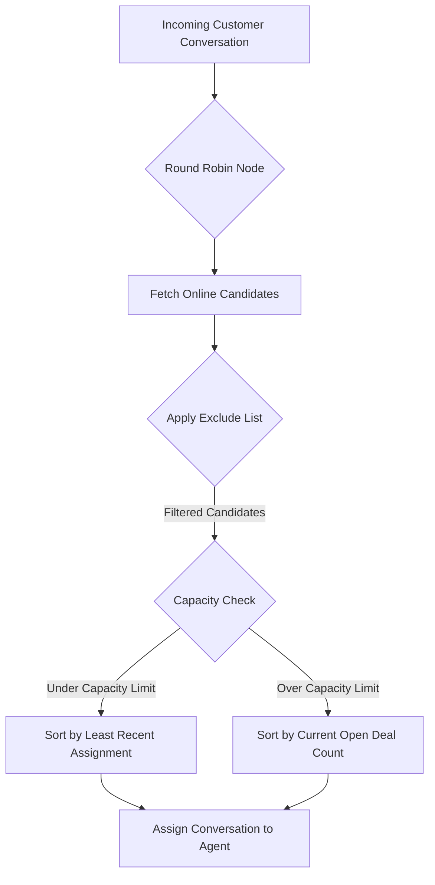

# 🚀 WhatsApp CRM & Automation Platform Features Documentation

This documentation provides an in-depth breakdown of the capabilities of your multi-tenant CRM, messaging automation, and integrated e-commerce system.

---

## 📋 Table of Contents
1. [Core CRM Features](#1-core-crm-features)
2. [Advanced Automation & Routing Features](#2-advanced-automation--routing-features)
3. [Special Highlight: CRM Round Robin Node](#3-special-highlight-crm-round-robin-node)
4. [Special Highlight: Recurring Contact Campaigns](#4-special-highlight-recurring-contact-campaigns)
5. [E-commerce Module & Add-ons](#5-e-commerce-module--add-ons)
6. [Advanced AI & Inbox Integrations](#6-advanced-ai--inbox-integrations)
7. [AI Flow Controls & Functions](#7-ai-flow-controls--functions)

---

## 1. Core CRM Features

### 👤 Contact & Lead Management
* **Unified Database**: Consolidates lead source details, WhatsApp information, customized attributes, tags, and status history.
* **Smart Filtering**: Advanced query builders to segment lists based on state, zip code, tags, active deals, and channels.
* **Customer Groups**: Create static or dynamic list groups for targeted outreach campaigns.

### 💼 Pipelines, Stages, & Deals
* **Custom Pipelines**: Create multiple visual sales funnels (e.g., Sales, Onboarding, Support).
* **Drag-and-Drop Stages**: Easily transition deals between stages (e.g., Lead, Contacted, Proposal, Closed-Won).
* **Deal Metadata**: Track deal values, assignees, products, currencies, and timestamps.

### 👥 Team & Workspace Management
* **Multi-Agent Inbox**: Share inbox conversations across team members.
* **Granular Permissions**: Restrict or grant team member access by roles (e.g., view only assigned conversations, edit store configurations, delete contacts).
* **Capacity Management**: Specify an integer-based **Open Deals Capacity Limit** per agent to prevent workloads from bottlenecking. Updates persist cleanly from the settings panel.

---

## 2. Advanced Automation & Routing Features

### 🛠️ Interactive Flow Builder
* **Visual Node Designer**: Map automated user journeys using trigger keywords, conditions, delays, message blocks, and actions.
* **Action Nodes**: Automatically route leads, update variables, generate payment links, and assign conversations.
* **Interactive WhatsApp Menus**: Send structured Cloud API buttons and lists for rapid user navigation.

---

## 3. Special Highlight: CRM Round Robin Node

The **CRM Round Robin Node** is designed for high-efficiency lead routing. When triggered, it automatically rotates new incoming conversations between eligible team members.

### How It Works:

### Key Capabilities:
1. **Online Status Only**: Assigns conversations only to active team members whose current status is set to `Online`.
2. **Open Deal Capacity Limit**:
   * If a team member has an open deal count matching or exceeding their configured **Capacity Limit**, they are skipped from the normal rotation.
   * If all agents are at capacity, the system falls back to the agent with the lowest open load.
3. **Smart Load Balancing**: Sorts available agents by their last assignment timestamp, ensuring rotation cycles are balanced and fair.
4. **Agent Exclusion List**:
   * Provides checkboxes to exclude specific team members (or the main store owner/admin) from being assigned to this node, allowing you to limit routing exclusively to dedicated sales representatives.

---

## 4. Special Highlight: Recurring Contact Campaigns

### Overview
Reach your audience at regular intervals with automated campaign dispatches. Instead of one-off blasts, you can configure template messages to go out on recurring intervals.

### Capabilities:
* **Dynamic Recurrence Rules**: Define schedule cycles (daily, weekly, monthly) using cron expressions or duration timers.
* **Dynamic Content Variables**: Inject contact tags and custom fields (e.g., `{{contact.firstName}}`, `{{order.number}}`) into WhatsApp template structures.
* **Batch Scheduling**: Staggers campaign deliveries to optimize WhatsApp api rates and avoid account flags.

---

## 5. E-commerce Module & Add-ons

A full-fledged checkout experience built directly into WhatsApp.

* **Product Catalogs**: Manage products, descriptions, photos, and prices from the admin ledger.
* **Base Currency Controls**: Enforces store-wide currency prefixes on all products, orders, invoices, and payment links.
* **Dynamic Delivery Fees**:
   * **Flat Rate**: Set a single standard delivery fee.
   * **State-Wise Rules**: Default delivery fee set worldwide with specific override states. State matching is done dynamically using the zippopotam.us API on customer PIN/Zip codes.
* **Automated PDF Invoices**: Generates a professional itemized invoice PDF immediately when payment is verified as `"paid"`, automatically dispatching it to the customer.
* **Self-Service Order Tracking**: Customers can check on their orders by texting **`track`** or **`status`** to prompt a self-service search.
* **Multi-Country Support**: Out-of-the-box ZIP code lookups for Bahrain (BH), Qatar (QA), Kuwait (KW), United Kingdom (GB), Egypt (EG), Oman (OM), Morocco (MA), France (FR), Germany (DE), Spain (ES), Portugal (PT), Brazil (BR), and India (IN).

---

## 6. Advanced AI & Inbox Integrations

### 🤖 AI in the Inbox
* **AI Copilot Assistance**: Agents receive real-time, context-aware suggestions directly inside the chat window to draft responses instantly.
* **Autopilot Conversational Mode**: The AI agent takes over standard customer messaging, responding directly to user inquiries without manual intervention.
* **Transcripts & Sentiment Analysis**: Tracks chat progression, summarizing user intent and highlighting deals that require immediate human follow-ups.

### 📚 Dynamic Chat-Based RAG (Knowledge Base)
* **Context Retrieval (RAG)**: Integrates Retrieval-Augmented Generation to search uploaded data dynamically, pulling matching facts to answer customer questions accurately.
* **Dynamic Training Sources**:
  * **URLs/Websites**: Crawls designated domain directories and stores scraped text patterns.
  * **Custom Documents**: Parse PDF, TXT, or CSV files to seed the model with specific store rules, FAQs, and product manuals.
  * **Database Syncing**: Synchronizes with products, catalog prices, and hours of operation.

### ⚙️ AI Profile Configuration
* **Provider Agnosticism**: Fully supports **OpenAI**, **Groq** (for lightning-fast sub-second responses), and **Sarvam.ai** (localized voices and translation).
* **Profile Attributes**:
  * Customize **System Prompt Templates** with dynamic tokens.
  * Select target models (e.g. `gpt-4o-mini`, `llama-3.3-70b-versatile`, `sarvam-105b-conversations`).
  * Tweak creativity parameters like **temperature** and **max tokens**.

---

## 7. AI Flow Controls & Functions

### ⏸️ AI Takeover Node
* **Handoff Automation**: A block inside the flow builder that suspends structured keyword responses and delegates control of the conversation completely to the AI agent.
* **Pause Rules**: Temporarily pauses keyword matching while the customer converses with the AI agent. If the customer requests human help or says a designated trigger phrase, the AI automatically escalates the chat and returns it to the team inbox queue.

### ⚡ AI Function & Action Calling
* **Tool Hooks**: The AI can trigger background operations dynamically based on the conversation context:
  * **Order Initialization**: Places products in the checkout queue.
  * **Appointment Scheduling**: Queries and books calendar slots.
  * **Status Lookups**: Retrieves real-time shipping/payment statuses from the CRM database.
